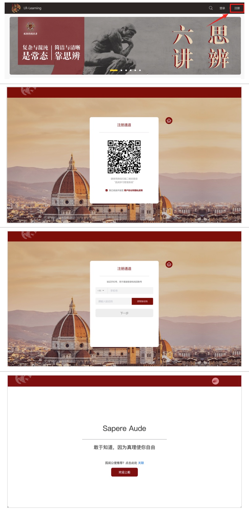
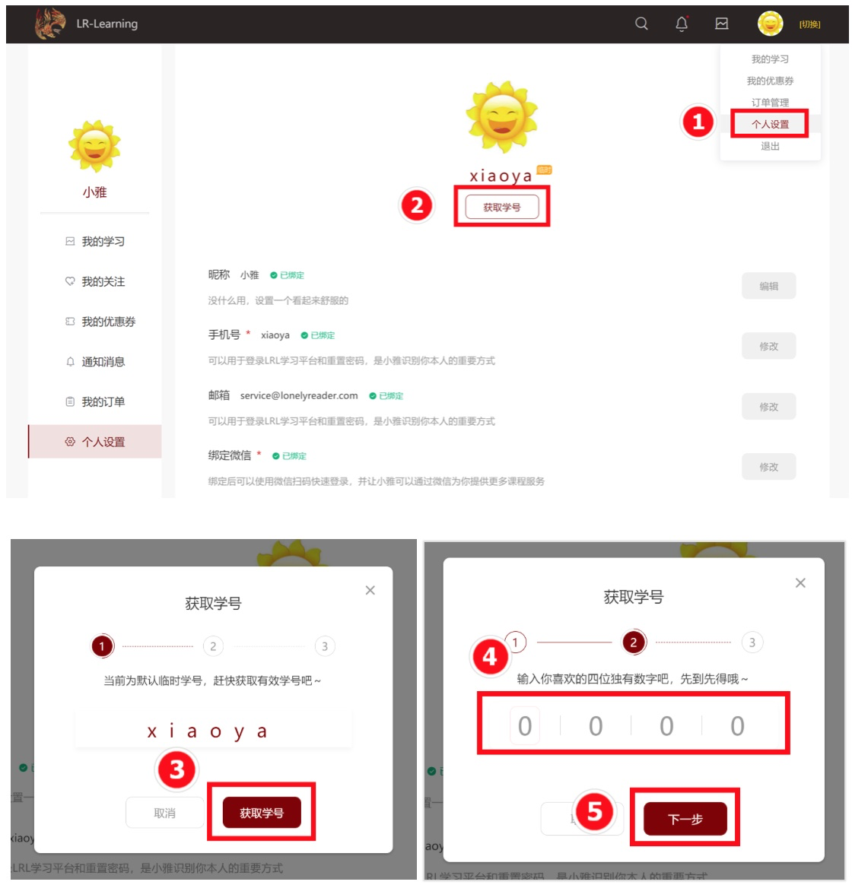

# LRL

LRL（LonelyReader Learning）是孤阅 2020 年启用的自主学习平台，您在孤阅的的所有学习活动都将在 LRL 上完成。

# LRL 注册登陆指南

为保证您获取完整的学习体验，请用 2 分钟时间注册账号并同步课程。

您可以在手机/平板端或者在电脑端注册并同步课程，步骤如下：

- [手机/平板端 | 注册 & 课程同步](?id=（手机平板端）注册amp课程同步)

- [电脑端 | 注册 & 课程同步](?id=电脑端-注册-amp-课程同步)

如果有其它问题，请看：

- [登陆注册常见问题](#登陆注册常见问题)

## （手机/平板端）注册&课程同步 

### 注册账号

① 点击移动端链接 >> https://m.lr.link/#/login  
② 点击注册   
③ 填入信息后，点击【注册并登陆】

### 课程同步

① 点击链接 >>  https://s.lr.link/13sh82  
② 点击【绑定】CCtalk账户  
③ 授权并登陆  
④ 查看已同步课程 >> https://m.lr.link/#/purchased ，完成同步  

## 电脑端 | 注册 & 课程同步

### 注册账号

> 建议注册后将首页添加至收藏夹，以便学习时快速找到

① 点击链接 >> lrl.lonelyreader.com  
② 点击右上角【注册】，使用微信扫码注册  
③ 验证手机号，完成注册    

### 课程同步
① 点击链接 >> https://lrl.lonelyreader.com/#/me/setting  
② 在个人设置里，【绑定】CCtalk账户  
③【确认授权】绑定账户后，点击【我的学习】查看已同步课程，完成同步  

# 登陆注册常见问题

Q1：请问注册的时候，公使码填什么？  
A1：公使码是选填项，若没有则不需要填写。

Q2：如何从手机端快速进入 LRL？  
A2：关注「孤阅」服务号，从菜单栏【立即学习】进入，详细参考 👇

  

 

Q3：如何获取孤阅专属学号？   
A3：在 LRL 电脑端【个人设置】获取，详细参考 👇
> 学号仅支持在电脑端获取   

Q4：在 LRL 使用过程中出现技术问题怎么办？  
A4：你可以在意见反馈平台[「兔小巣」的【常见问题】](https://support.qq.com/products/121417/faqs-more/)查看是否已经有解决方案。

Q5：没有在「兔小巣」上找到解决方案怎么办？  
A5： 

- 方法一：你可以在[兔小巣](https://support.qq.com/products/121417?)上给我们留言问题（为尽快协助你解决，请将出现问题的页面截图并一同留言）；

- 方法二：你可以扫描下方二维码进群提问（@dana｜技术雅）；

Q6：使用过程中想提建议，帮助 LRL 更好用怎么办？  
A6：欢迎通过上一个问题（Q5）的两种种路径之一给我们留言，在此提前谢过！🙇🏻‍♀️🙇🏻‍♂️
